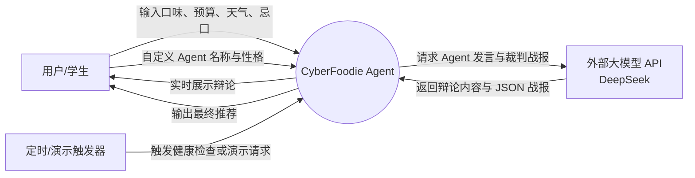
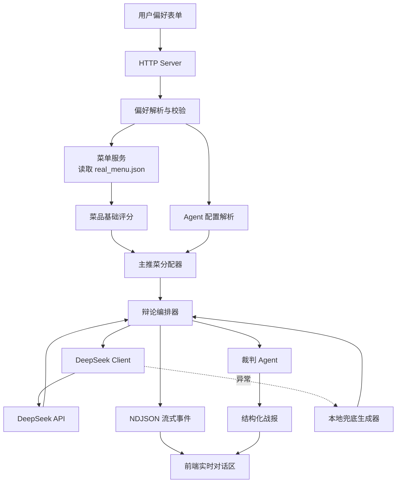
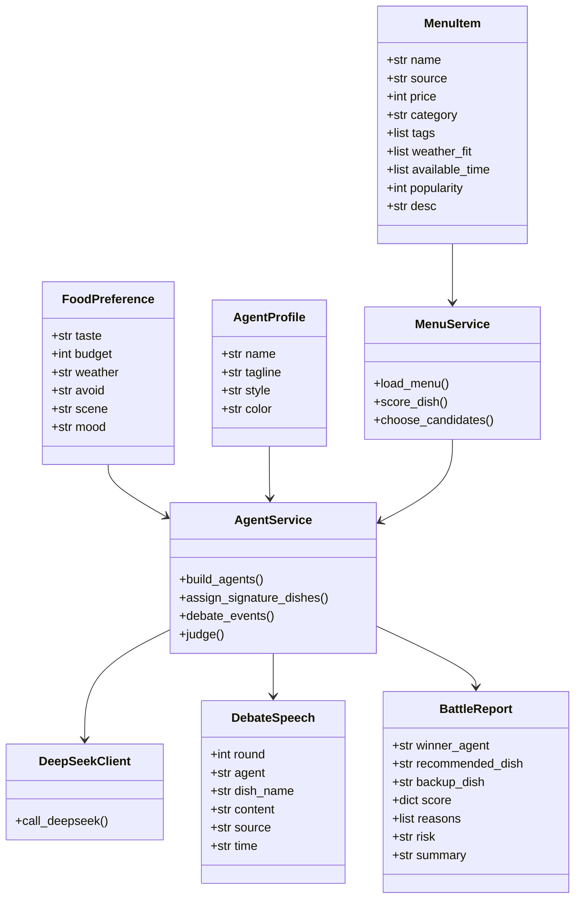
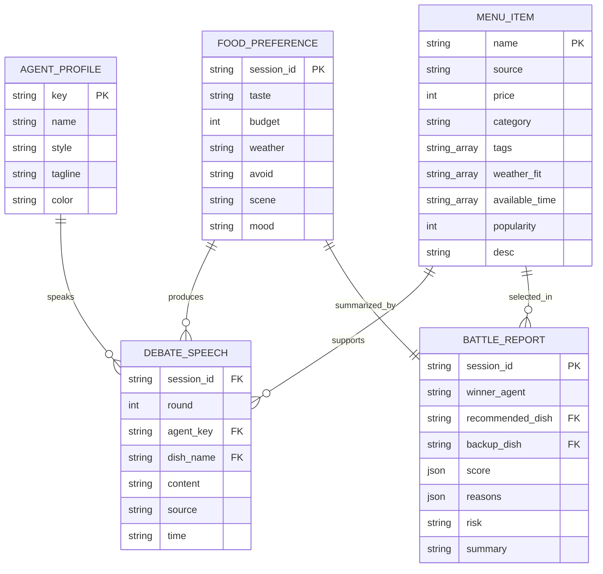
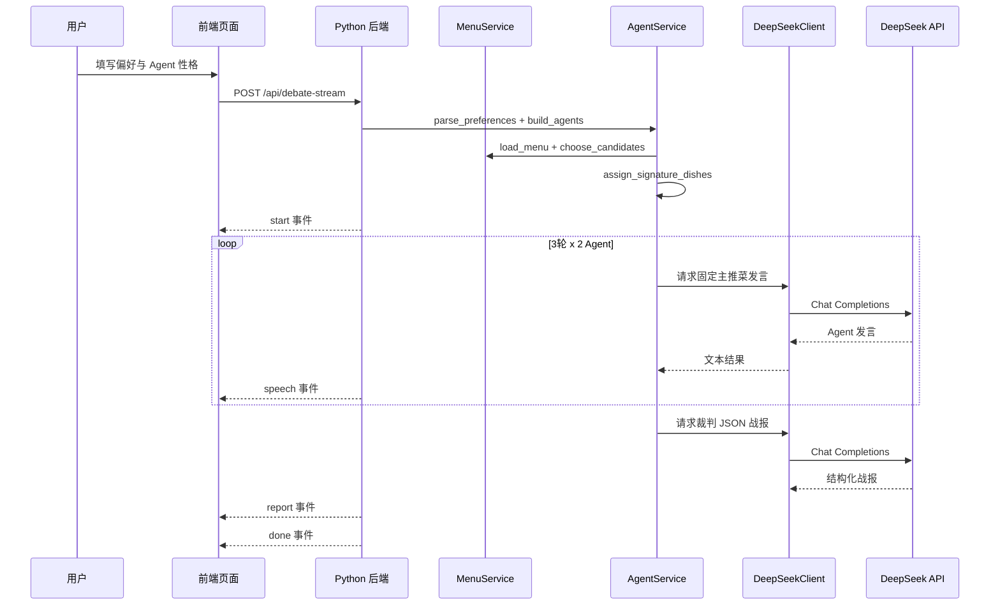
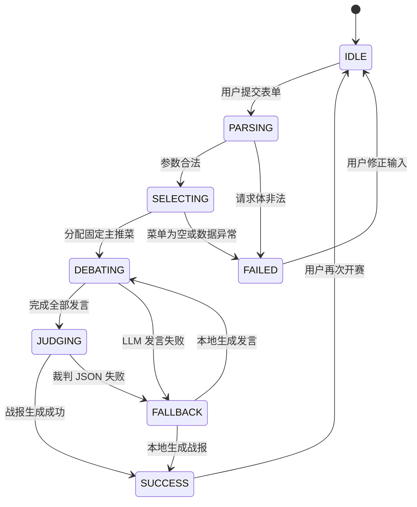

# CyberFoodie Agent 系统级架构设计规约

## 1. 系统概述

CyberFoodie Agent 面向大学生日常“今天吃什么”的决策困难场景。系统读取真实菜单 JSON，结合用户的口味、预算、天气、忌口、就餐场景和心情输入，为两个不同菜系/性格的 AI Agent 分配固定主推菜。随后两个 Agent 进行三轮实时辩论，最后由裁判 Agent 输出结构化选餐战报。

系统边界包含前端页面、Python 后端服务、菜单数据文件、DeepSeek 外部大模型 API 和本地兜底逻辑。当前版本不依赖数据库，菜单以 JSON 文件持久化，辩论会话以内存对象维护。

## 2. 功能模型

### 2.1 系统顶层用例图

### 2.2 系统数据流图

## 3. 数据模型

### 3.1 系统领域类图

### 3.2 ER Diagram / Schema

说明：当前实现以 JSON 文件和内存对象承载以上 Schema。若后续接入数据库，可将 `MENU_ITEM` 作为菜品表，`FOOD_PREFERENCE`、`DEBATE_SPEECH`、`BATTLE_REPORT` 作为会话记录表，并为 `session_id`、`agent_key`、`dish_name` 建立索引。

核心数据契约在 `src/cyberfoodie/schemas.py` 中以 dataclass 表达，可平滑迁移为 Pydantic BaseModel。

## 4. 动态 / 行为模型

### 4.1 端到端核心时序图

### 4.2 系统生命周期状态机图

## 5. 关键架构约束

- 菜单数据必须来自 `src/data/real_menu.json`，页面不提前暴露候选全集。
- 每个 Agent 在辩论开始前锁定一个固定主推菜，三轮中不得改变立场。
- 裁判 Agent 的推荐范围限定在两个固定主推菜内。
- DeepSeek 调用失败时必须进入本地兜底流程，保证演示稳定。
- 前端使用流式 NDJSON 响应逐条展示发言。
