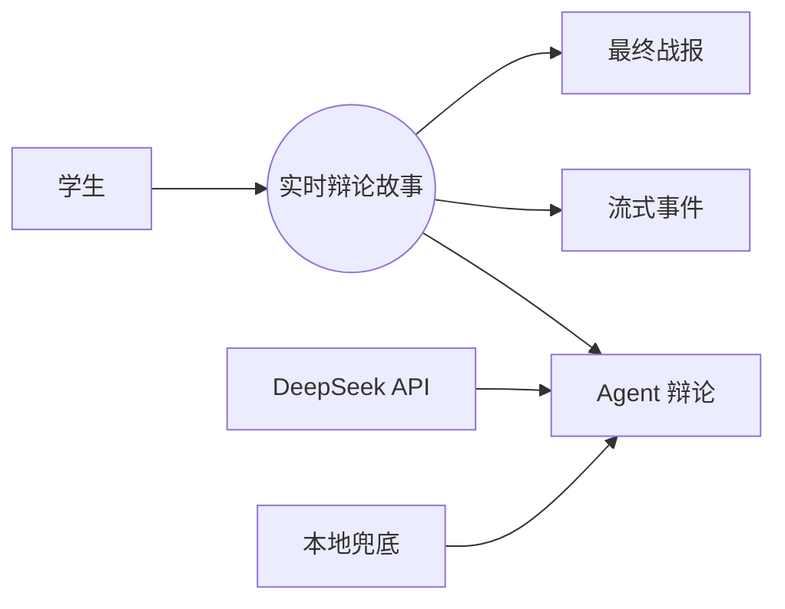
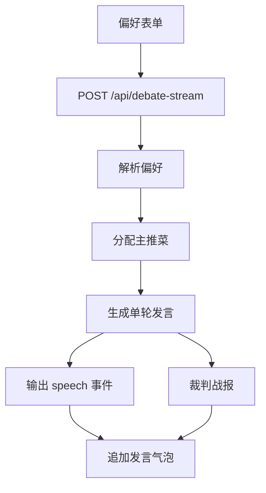
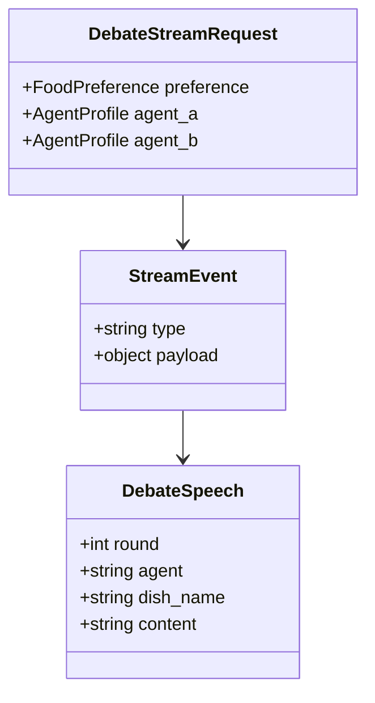
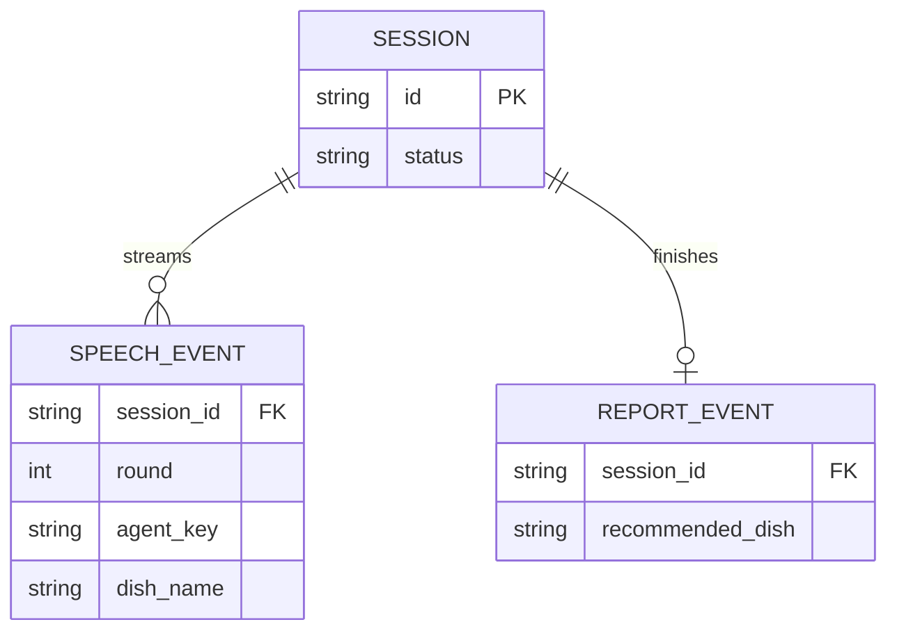
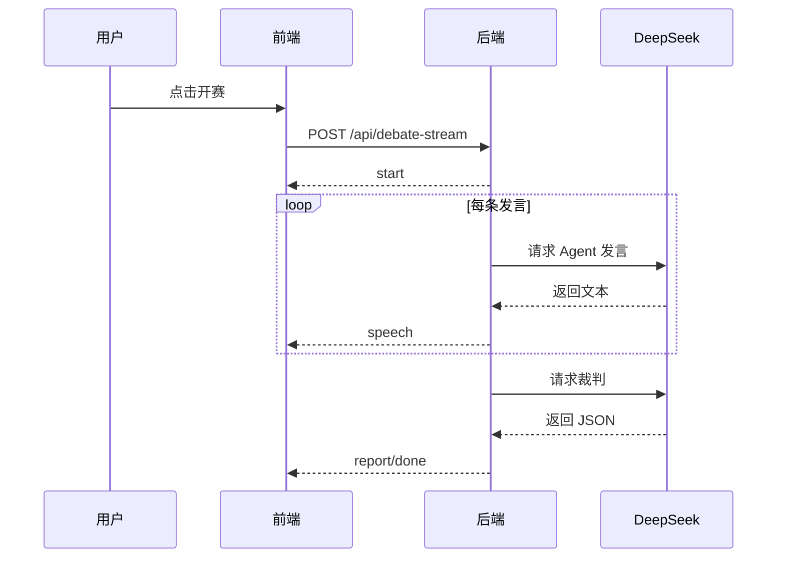
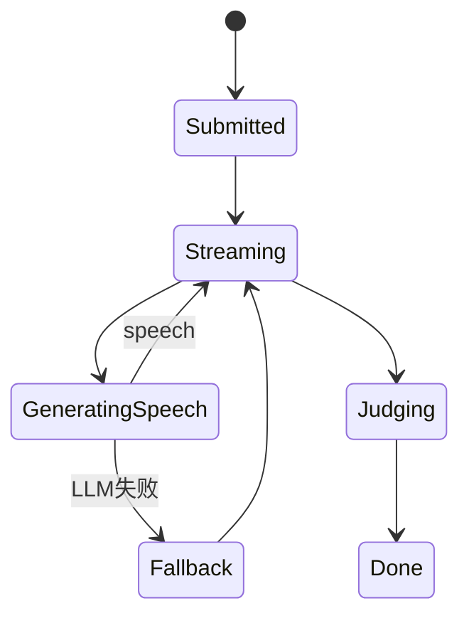

# US01 实时 AI 干饭辩论

## Card

作为学生，我希望提交用餐偏好后实时看到两个 AI 大厨逐轮辩论，以便在等待模型生成时理解推荐过程，而不是只看到最终结果。

## INVEST

| 原则 | 说明 |
| --- | --- |
| Independent | 可独立实现为 `/api/debate-stream` 与前端流式渲染。 |
| Negotiable | 发言轮数、显示字段和状态文案可调整。 |
| Valuable | 提升课堂展示效果和推荐可解释性。 |
| Estimable | 涉及后端流式输出、前端读取流和状态更新。 |
| Small | MVP 范围限定为 3 轮、2 个 Agent。 |
| Testable | 可断言返回 start、speech、report、done 事件。 |

## Conversation

- 用户提交口味、预算、天气、忌口、场景和心情。
- 系统分配两个固定主推菜。
- 系统每生成一条发言就推送到前端。
- DeepSeek 单次失败时使用本地兜底，不中断会话。

## Confirmation

```gherkin
Feature: 实时辩论
  Scenario: 用户提交偏好后逐条看到发言
    Given 用户填写完整用餐偏好
    When 用户点击开赛
    Then 页面应实时追加两个 Agent 的发言
    And 每个 Agent 应完成三轮发言
    And 页面最终展示结构化战报
```

## 1. 故事级用例 / 边界图



## 2. 故事级组件 / 数据流图



## 3. 故事级领域类与数据契约图



## 4. 故事级数据实体关系 / 持久化模型



## 5. 故事级端到端时序交互图



## 6. 故事级微观状态转换与活动流程图


