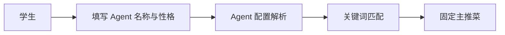
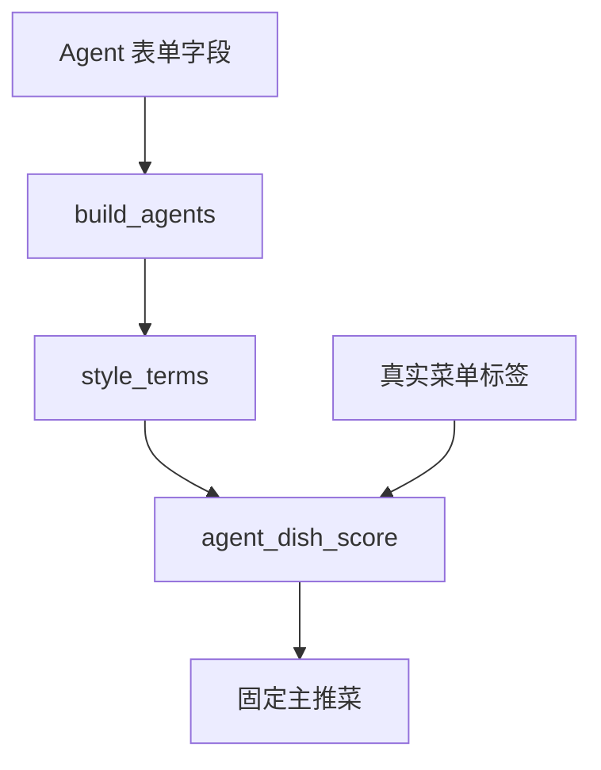
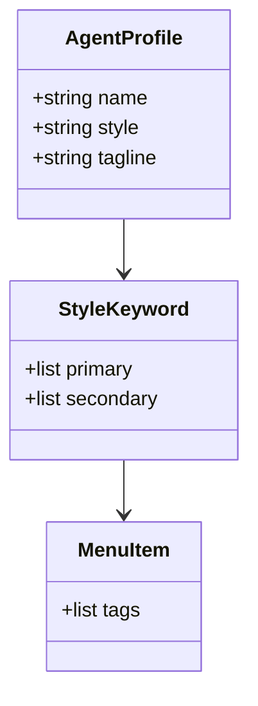
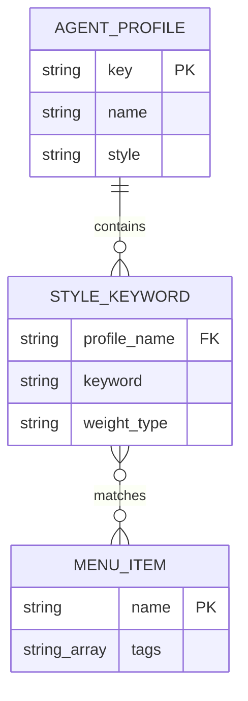
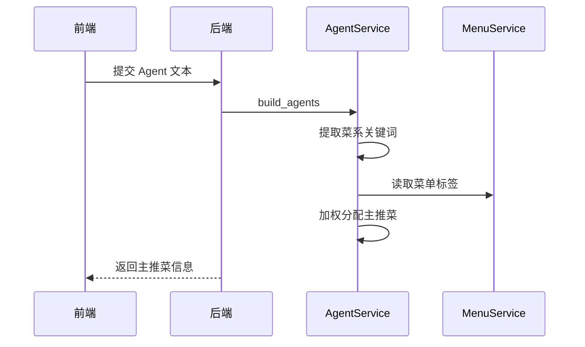
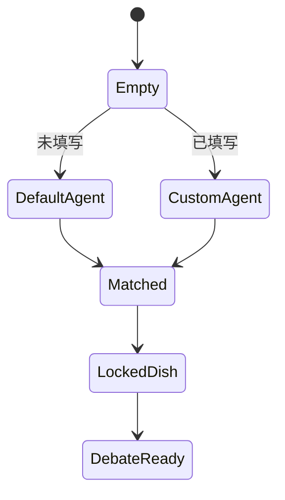

# US02 自定义菜系 Agent

## Card

作为学生，我希望自定义两个 Agent 的名称和性格，使辩论双方能够代表不同菜系或饮食立场。

## INVEST

| 原则 | 说明 |
| --- | --- |
| Independent | Agent 配置通过请求体传入，不依赖其他故事。 |
| Negotiable | 可调整提示词样例和默认菜系。 |
| Valuable | 支持更多课堂演示组合。 |
| Estimable | 涉及表单字段、配置解析和 prompt 注入。 |
| Small | 当前只支持文本输入，不做持久化预设。 |
| Testable | 可验证不同菜系 Agent 匹配不同标签菜品。 |

## Conversation

- 用户可使用默认川湘/粤式 Agent。
- 用户也可输入“西北碳水派”“江浙甜鲜派”等自定义名称。
- 系统根据名称和性格中的关键词匹配菜单标签。
- 自定义 Agent 不改变三轮固定主推菜约束。

## Confirmation

```gherkin
Feature: 自定义 Agent
  Scenario: 用户输入两个菜系 Agent
    Given 用户填写西北碳水派和江浙甜鲜派
    When 系统分配主推菜
    Then 西北 Agent 应优先匹配西北或面食标签
    And 江浙 Agent 应优先匹配江浙或酸甜鲜香标签
```

## 1. 故事级用例 / 边界图



## 2. 故事级组件 / 数据流图



## 3. 故事级领域类与数据契约图



## 4. 故事级数据实体关系 / 持久化模型



## 5. 故事级端到端时序交互图



## 6. 故事级微观状态转换与活动流程图


