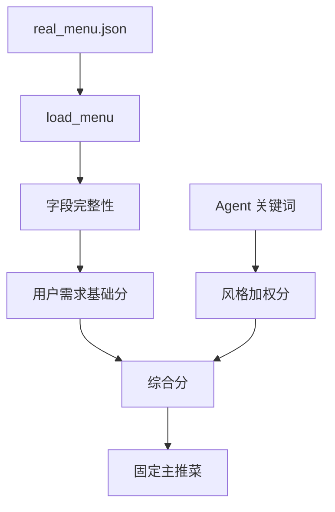
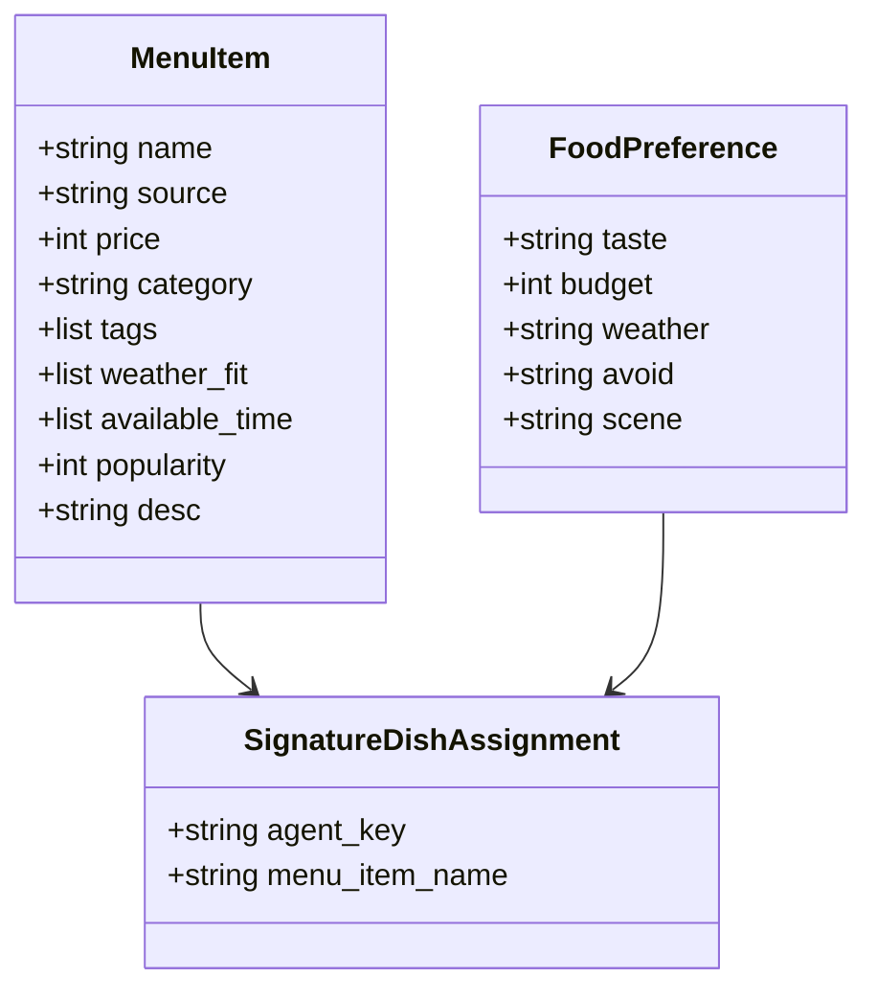
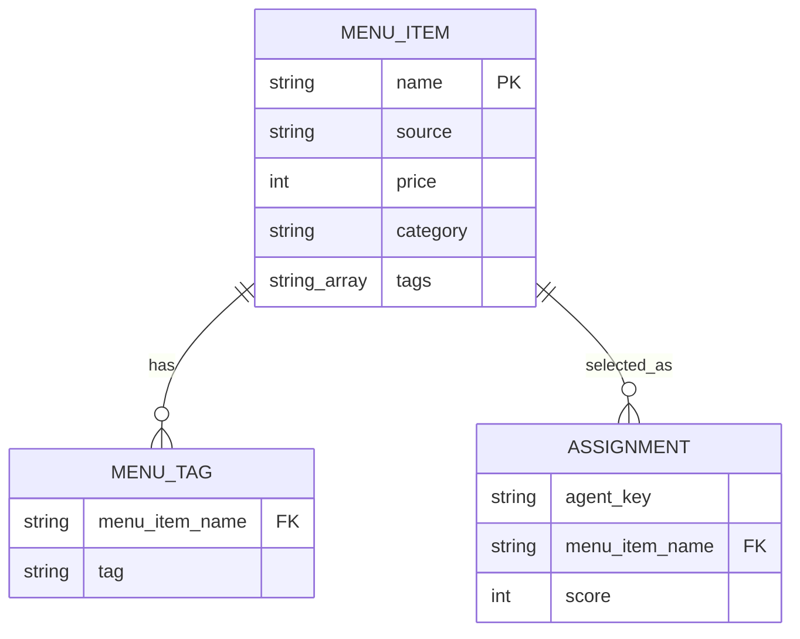
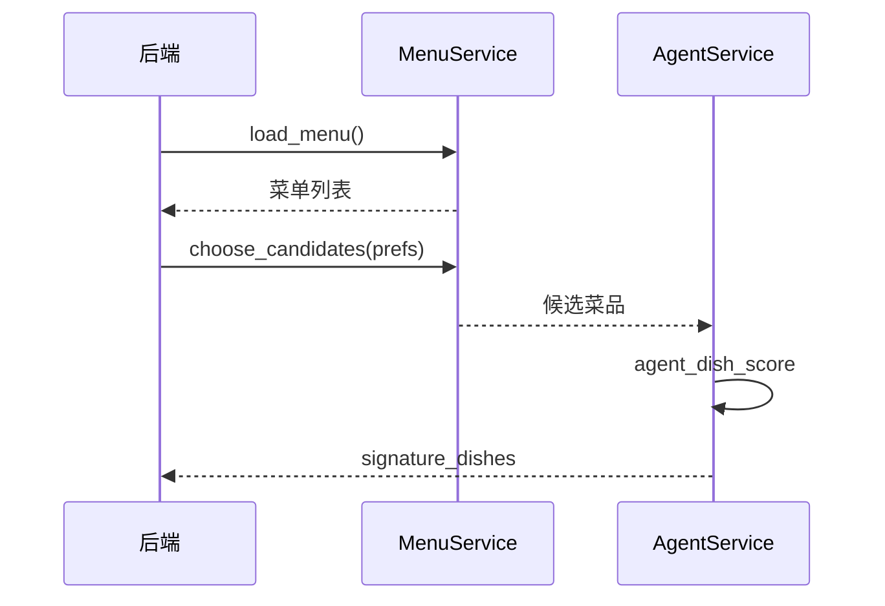
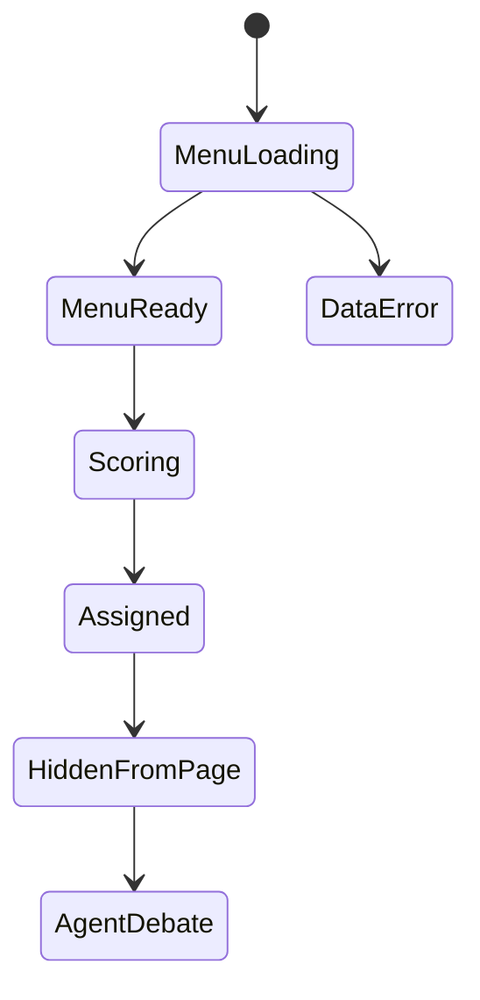

# US03 基于真实菜单数据推荐

## Card

作为学生，我希望系统根据食堂真实菜单数据进行推荐，以便结果更接近校园实际可获得的菜品。

## INVEST

| 原则 | 说明 |
| --- | --- |
| Independent | 菜单数据以 JSON 读取，可独立维护。 |
| Negotiable | 菜品数量、标签体系和评分权重可迭代。 |
| Valuable | 推荐结果更真实，便于课堂展示。 |
| Estimable | 涉及菜单 Schema、读取、评分和测试。 |
| Small | 当前不接数据库，仅维护本地 JSON。 |
| Testable | 可检查菜单数量、字段完整性和标签匹配。 |

## Conversation

- 菜单保存在 `src/data/real_menu.json`。
- 每道菜含名称、来源、价格、分类、标签、天气适配、供应时段、热度和描述。
- 系统不会在页面提前展示完整候选菜单。
- Agent 会读取菜单，并只展示自己最终分配到的主推菜。

## Confirmation

```gherkin
Feature: 真实菜单推荐
  Scenario: 菜单数据参与主推菜分配
    Given 菜单 JSON 至少包含 30 道带标签菜品
    When 用户提交偏好
    Then 系统应读取菜单进行评分
    And 两个 Agent 应获得不同主推菜
    And 最终推荐应来自两个主推菜之一
```

## 1. 故事级用例 / 边界图


## 2. 故事级组件 / 数据流图



## 3. 故事级领域类与数据契约图



## 4. 故事级数据实体关系 / 持久化模型



## 5. 故事级端到端时序交互图



## 6. 故事级微观状态转换与活动流程图


